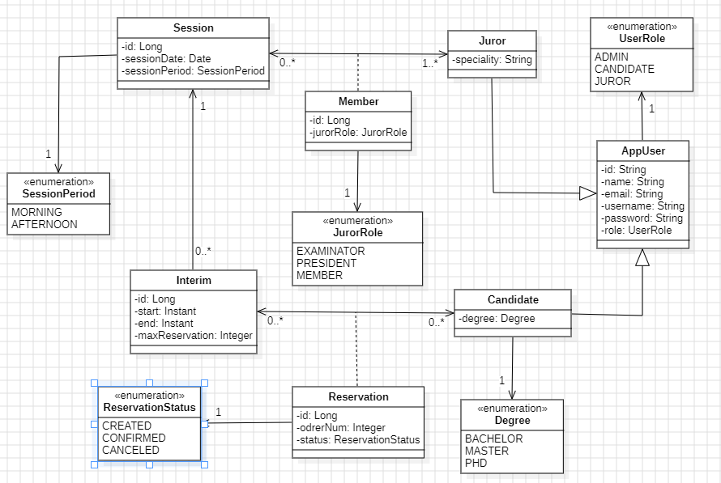
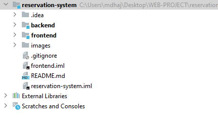

# Système de réservation des séances oraux

## Conception

### Diagramme de cas d'utilisation

Après la lecture et analyse du système que nous doit réaliser, on a sortie par le diagramme de `cas d'utilisation` suivant :

### Diagramme de classe

Pour répondre aux besoins exigés par l'énoncé, on a essayé de modéliser les entités qui interagissent dans le système de réservation sous forme d'un
`diagramme de classe` : 

## Réalisation

Pour la réalisation, notre projet est divisé en deux modules :
* `backend`: c'est un module `Spring` pour la partie backend.
*  `frontend`: c'est un module `Angular` pour la partie frontend.

